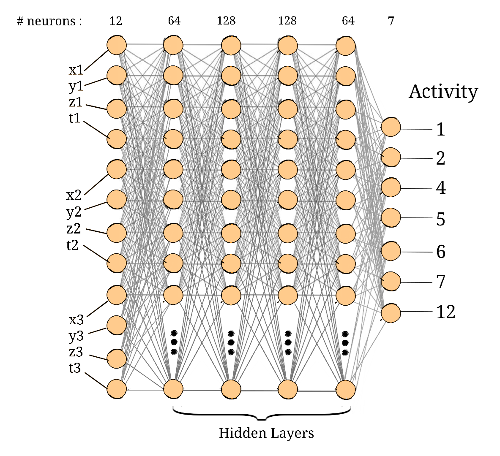

# CSE465_Spring2025_Group-4
Project for CSE465 on 'Nurse Care Activity Recognition' using Machine Learning.
## Team Contributions

| Name                                      | Email                              | Contact No.   | Contribution         |
|-------------------------------------------|------------------------------------|--------------|----------------------|
| Abdullah Mohammad Muntasir Adnan Jami     | abdullah.jami@northsouth.edu      | 1612109658   | [Senior Developer] (40%) |
| Hasan Bin Omar                            | hasan.omar@northsouth.edu         | 1301769242   | [Junior Developer] (30%) |
| Abrar Ur Alam                             | abrar.alam@northsouth.edu         | 1733387871   | [Junior Developer] (30%)|

Everyone mostly had a hand in all the parts starting with dataset cleaning, combining and training a model.
Hasan did the augmentation part and Abrar made the Network.jpg image aside from the above.
Our senior developer, Adnan bhai, worked harder than the rest of us and guided us through out the whole process.

## Data Augmentation Technique

The dataset is augmented using **noise addition, and scaling** to increase variability and improve model generalization.

1. **Adding Noise**:  
   - Gaussian noise (**mean = 0**, **std = 0.10**) is added to sensor readings.

2. **Scaling**:  
   - Each sensor value is multiplied by a random scaling factor in the range **(0.94, 1.06)** to introduce slight variations in magnitude.

## Five fold cross validation result
| Metric                | Average Accuracy | Average Precision | Average Recall | Average F1-Score |
|-----------------------|------------------|-------------------|----------------|------------------|
| Value                 | 81.49            | 80.52             | 81.49          | 80.79            |

## Future Plan

For now we have only used accelerometer sensor data from user 4 only so our next plan is use all the other ones and try out approaches such as CNN or RNN to see how it compares with ANN, the one we are currently using.

## Dataset Link
[Download from Google Drive](https://drive.google.com/file/d/1PLSxD0UMmuWyphyazXXFiAq-FMOx5nJV/view?usp=sharing)
